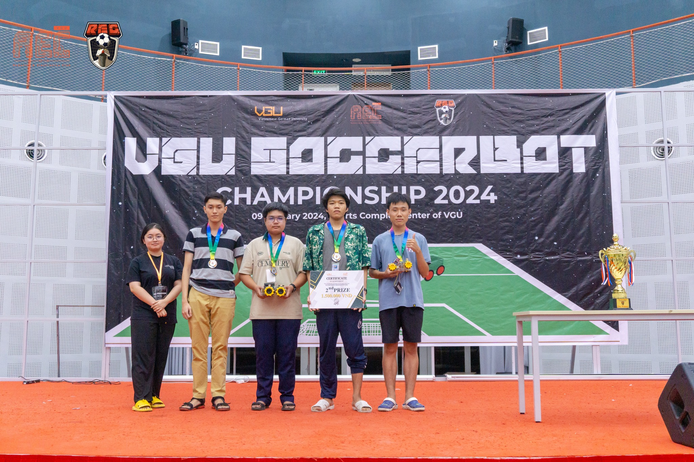

# Soccer_bot_esp32_mecanum_Wheels

# Seccond_Prize at VGU

# If you want to use the mecanum motor library:
- Coppy the motor.cpp file and motor.h file and place them to your project folder.

# Resources:
https://github.com/robot-soccer-kit/robot-soccer-kit
https://randomnerdtutorials.com/esp32-dc-motor-l298n-motor-driver-control-speed-direction/
https://esp32io.com/tutorials/esp32-dc-motor
https://en.wikipedia.org/wiki/Mecanum_wheel